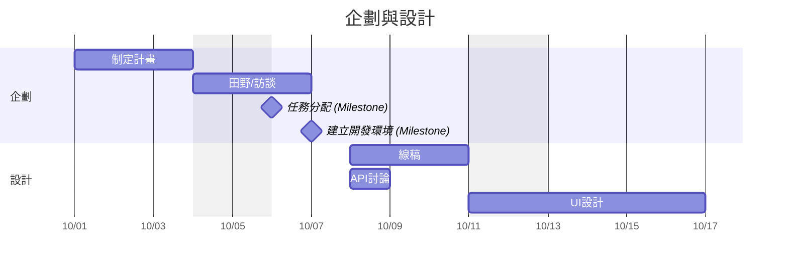
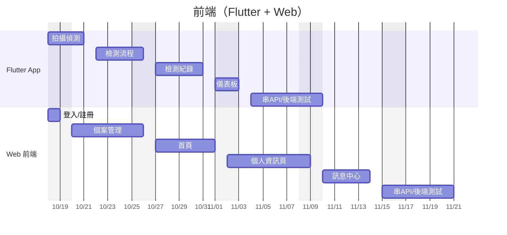
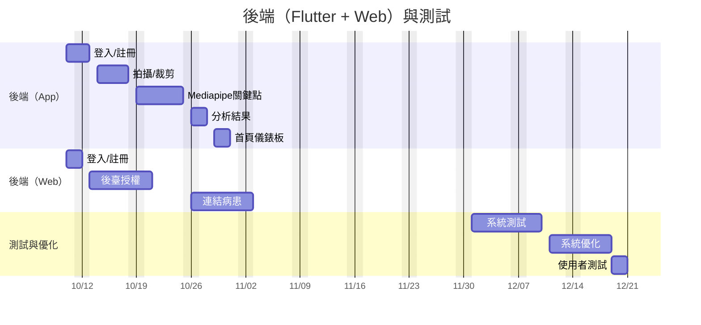

## 組員任務分配
### 葉峯菁
>醫師端網頁平台前端畫面程式撰寫(首頁、個案管理、訊息中心、個人資訊頁面、登入、註冊
### 簡家鴻
>線稿圖設計、 UI設計，Flutter(拍攝偵測、檢測紀錄，儀表板，檢測流程設計)
### 林修同
>APP後端程式開發(登入註冊功能、Mediapipe偵測關鍵點、影片拍攝、裁剪功能、首頁儀錶板、分析結果)
### 林竣翔
>web後端程式開發(登入註冊功能、連結病患的功能、後臺管理授權功能)

## 專題甘特圖




## PERT/CPM


```flow
st=>start: 專案開始

e=>end: 專案完成

sub1=>operation: 制定計畫 (10/01-10/03)
sub2=>operation: 田野調查/使用者訪談 (10/04-10/05)
sub3=>operation: 任務分配 (10/06)
sub4=>operation: 建立開發環境 (10/07)

d1=>operation: 線稿圖設計(家鴻) (10/08-10/10)
d2=>operation: API設計討論(all) (10/08-10/09)
d3=>operation: UI設計(家鴻) (10/11-10/17)

f1=>operation: Flutter 拍攝偵測功能 (10/18-10/21)
f2=>operation: Flutter 檢測流程設計 (10/22-10/26)
f3=>operation: Flutter 檢測紀錄 (10/27-10/31)
f4=>operation: Flutter 儀表板 (11/01-11/03)
f5=>operation: Flutter 串接API及後端測試 (11/04-11/10)

w1=>operation: Web 登入註冊 (10/18-10/19)
w2=>operation: Web 個案管理 (10/20-10/26)
w3=>operation: Web 首頁 (10/27-11/01)
w4=>operation: Web 個人資訊頁 (11/02-11/09)
w5=>operation: Web 訊息中心 (11/10-11/14)
w6=>operation: Web 串接API及後端測試 (11/15-11/21)

ba1=>operation: APP後端 登入註冊 (10/10-10/13)
ba2=>operation: APP後端 拍攝/裁剪 (10/14-10/18)
ba3=>operation: APP後端 Mediapipe關鍵點 (10/19-10/25)
ba4=>operation: APP後端 分析結果 (10/26-10/28)
ba5=>operation: APP後端 首頁儀錶板 (10/29-10/31)

bw1=>operation: Web後端 登入註冊 (10/10-10/12)
bw2=>operation: Web後端 後臺授權 (10/13-10/21)
bw3=>operation: Web後端 連結病患功能 (10/26-11/03)

t1=>operation: 系統測試 (12/01-12/10)
t2=>operation: 系統優化 (12/11-12/19)
t3=>operation: 使用者測試 (12/19-12/21)

st->sub1->sub2->sub3->sub4
sub4->d1->d3->f1->f2->f3->f4->f5->t1
sub4->d2->d3
sub4->ba1->ba2->ba3->ba4->ba5->f5
sub4->bw1->bw2->bw3->w6->t1
sub4->w1->w2->w3->w4->w5->w6

t1->t2->t3->e
```
