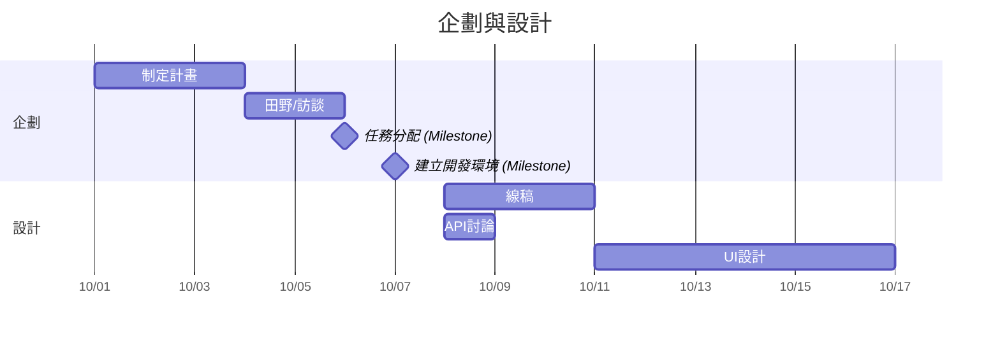
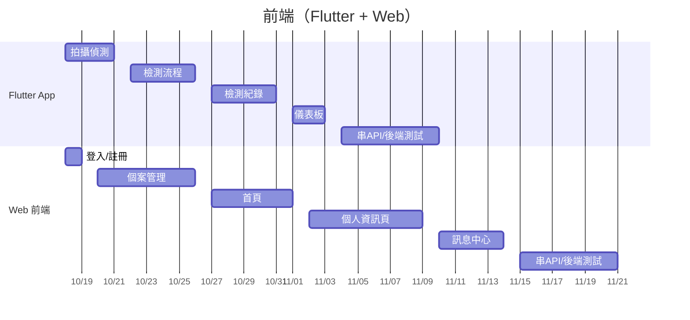
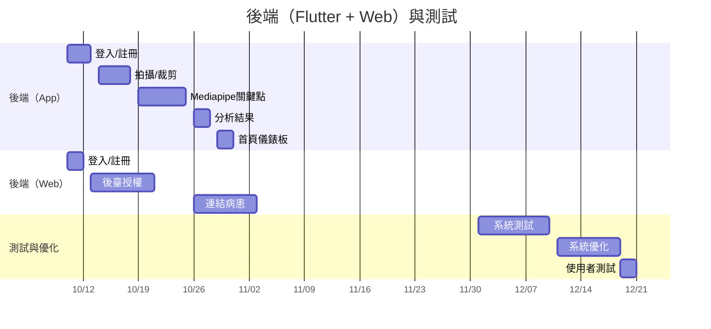
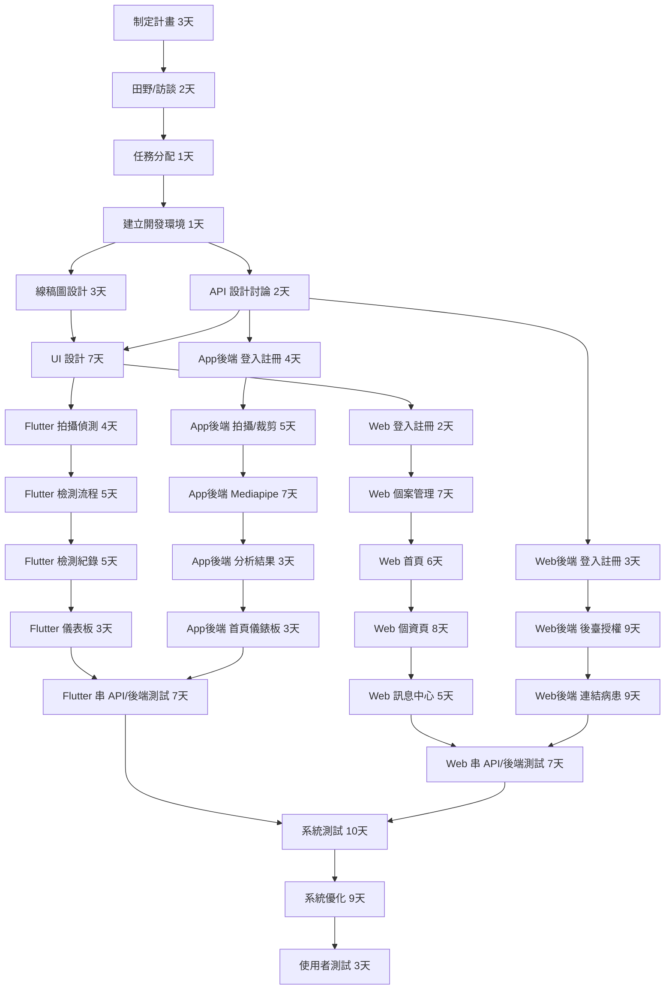

## 組員任務分配
### 葉峯菁
>醫師端網頁平台前端畫面程式撰寫(首頁、個案管理、訊息中心、個人資訊頁面、登入、註冊
### 簡家鴻
>線稿圖設計、 UI設計，Flutter(拍攝偵測、檢測紀錄，儀表板，檢測流程設計)
### 林修同
>APP後端程式開發(登入註冊功能、Mediapipe偵測關鍵點、影片拍攝、裁剪功能、首頁儀錶板、分析結果)
### 林竣翔
>web後端程式開發(登入註冊功能、連結病患的功能、後臺管理授權功能)

## 專題甘特圖

## PERT/CPM

