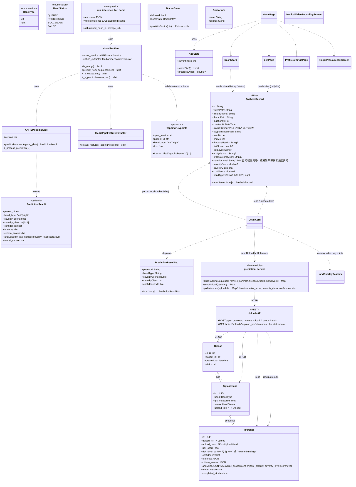
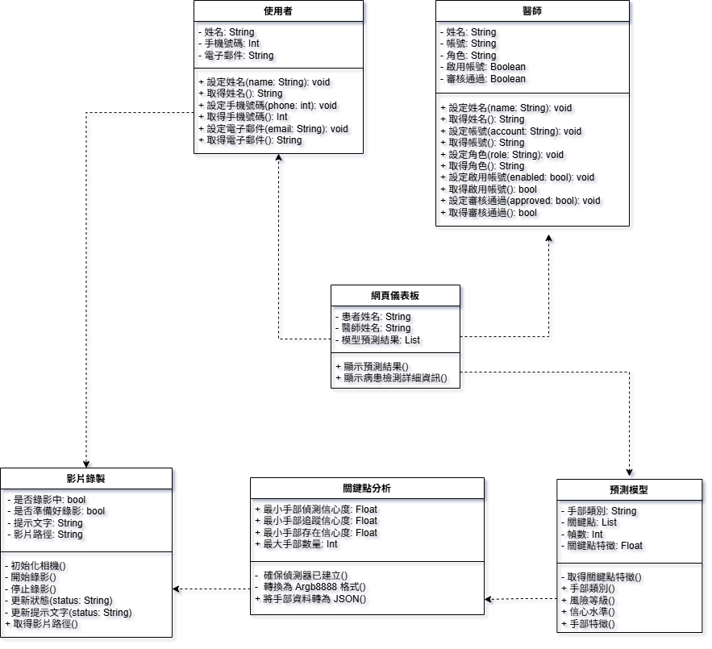

```mermaid
classDiagram
    %% =========================
    %% Django / Inference (Backend)
    %% =========================
    class Upload {
        +id: UUID
        +patient_id: str
        +created_at: datetime
        +status: str
    }

    class HandType {
        <<enumeration>>
        left
        right
    }

    class HandStatus {
        <<enumeration>>
        QUEUED
        PROCESSING
        SUCCEEDED
        FAILED
    }

    class UploadHand {
        +id: UUID
        +hand: HandType
        +fps_measured: float
        +status: HandStatus
        +upload_id: FK -> Upload
    }

    class Inference {
        +id: UUID
        +upload: FK -> Upload
        +upload_hand: FK -> UploadHand
        +risk_score: float
        +risk_level: str %% 可為 "0~4" 或 "low/medium/high"
        +confidence: float
        +features: JSON
        +criteria_scores: JSON
        +analysis: JSON %% overall_assessment, rhythm_stability, severity_level score/level
        +model_version: str
        +completed_at: datetime
    }

    Upload "1" o-- "2" UploadHand : has
    UploadHand "1" o-- "0..1" Inference : produces

    class run_inference_for_hand {
        <<celery task>>
        +__call__(upload_hand_id, storage_url)
        +reads raw JSON
        +writes Inference & UploadHand.status
    }

    class ModelRuntime {
        -model_service: ANFISModelService
        -feature_extractor: MediaPipeFeatureExtractor
        +is_ready(): bool
        +predict_from_sequence(seq): dict
        +_a_extract(seq): dict
        +_a_predict(features, seq): dict
    }

    class ANFISModelService {
        +version: str
        +predict(features, tapping_data) PredictionResult
        +_process_prediction(...)
    }

    class MediaPipeFeatureExtractor {
        +extract_features(TappingKeypoints): dict
    }

    class TappingKeypoints {
        <<pydantic>>
        +spec_version: str
        +patient_id: str
        +hand_type: "left"|"right"
        +fps: float
        +frames: List[KeypointFrame(10)]
    }

    class PredictionResult {
        <<pydantic>>
        +patient_id: str
        +hand_type: "left"|"right"
        +severity_score: float
        +severity_class: int[0..4]
        +confidence: float
        +features: dict
        +criteria_scores: dict
        +analysis: dict %% includes severity_level score/level
        +model_version: str
    }

    run_inference_for_hand ..> ModelRuntime : calls
    ModelRuntime ..> ANFISModelService : uses
    ModelRuntime ..> MediaPipeFeatureExtractor : uses
    ANFISModelService ..> PredictionResult : returns
    ModelRuntime ..> TappingKeypoints : validates/input schema

    %% =========================
    %% Django API (simplified)
    %% =========================
    class UploadsAPI {
        <<REST>>
        +POST /api/v1/uploads/ : create upload & queue hands
        +GET /api/v1/uploads/~upload_id~/inferences/ : list status/data
    }

    UploadsAPI ..> Upload : CRUD
    UploadsAPI ..> UploadHand : CRUD
    UploadsAPI ..> Inference : read

    %% =========================
    %% Flutter (App / Frontend)
    %% =========================
    class AnalysisRecord {
        <<Hive>>
        +id: String
        +videoPath: String
        +displayName: String
        +thumbPath: String
        +durationMs: int
        +createdAt: DateTime
        +status: String %% 已完成/分析中/失敗
        +keypointsJsonPath: String
        +startMs: int
        +endMs: int
        +firebaseUserId: String?
        +riskScore: double?
        +riskLevel: String?
        +analysisJson: String?
        +criteriaScoresJson: String?
        +severityLevel: String? %% 正常/輕微異常/中度異常/明顯異常/嚴重異常
        +severityScore: double?
        +severityClass: int?
        +confidence: double?
        +handType: String? %% 'left' | 'right'
        +fromServerJson(j): AnalysisRecord
    }

    class PredictionResultDto {
        +patientId: String
        +handType: String
        +severityScore: double
        +severityClass: int
        +confidence: double
        +fromJson(j): PredictionResultDto
    }

    class prediction_service {
        <<Dart module>>
        +buildTappingSequenceFromFile(jsonPath, firebaseUserId, handType): Map
        +sendUpload(payload): Map
        +pollInference(uploadId): Map %% returns risk_score, severity_class, confidence, etc.
    }

    class AppState {
        +currentIndex: int
        +switchTab(i): void
        +progressOf(id): double?
    }

    class DoctorState {
        +isPaired: bool
        +doctorInfo: DoctorInfo?
        +pairWithDoctor(pin): Future~void~
    }

    class DoctorInfo {
        +name: String
        +hospital: String
    }

    class HomePage
    class Dashboard
    class ListPage
    class DetailCard
    class ProfileSettingsPage
    class FingerPressureTestScreen
    class MedicalVideoRecordingScreen
    class HandOverlayRealtime

    %% Pages & state
    HomePage ..> AppState : uses
    HomePage ..> Dashboard
    HomePage ..> ListPage
    HomePage ..> ProfileSettingsPage
    HomePage ..> FingerPressureTestScreen

    Dashboard ..> AnalysisRecord : reads Hive (history / status)
    ListPage ..> AnalysisRecord : reads Hive (daily list)
    DetailCard ..> AnalysisRecord : read & update Hive
    DetailCard ..> prediction_service : sendUpload/pollInference
    DetailCard ..> HandOverlayRealtime : overlay video+keypoints

    %% Cross-system data flow
    prediction_service ..> UploadsAPI : HTTP
    UploadsAPI ..> Inference : returns results
    DetailCard ..> PredictionResultDto : displays
    AnalysisRecord <.. DetailCard : persist local cache (Hive)
```

# UML 類別圖

