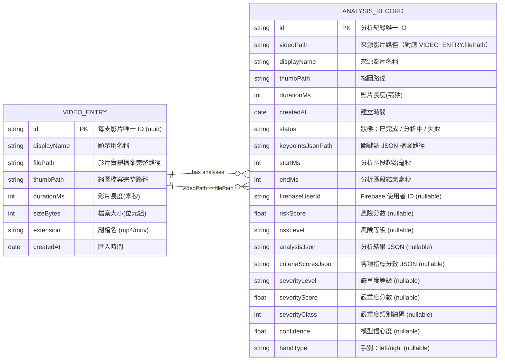

# ParkiPal - 智慧型居家帕金森氏症動作評估系統

-----
## APP端ERD圖


------
## WEB平台端ERD圖
```mermaid
erDiagram

  HOSPITAL_USER {
    string  user_id PK        "User ID（主鍵，UUID 字串）"
    string  account           "帳號 (unique)"
    string  pwd               "密碼（hashed）"
    string  name              "名稱"
    string  phone             "電話 (unique, 可為空)"
    string  role              "角色 (doctor/admin)"
    datetime created_at       "建立時間"
    datetime last_login_at    "最後登入時間"
    boolean is_active         "啟用"
    boolean is_approved       "審核通過"
  }

  LINK_CODE {
    uuid    id PK             "主鍵"
    string  code              "6 碼驗證碼 (index)"
    uuid    hospital_user_id FK "HospitalUser 外鍵"
    datetime created_at       "建立時間"
    datetime expires_at       "到期時間"
    boolean is_used           "是否已使用"
    datetime used_at          "使用時間"
    smallint max_uses         "最大使用次數"
    smallint uses             "已使用次數"
    text    note              "備註"
  }

  NOTIFICATION {
    int     id PK             "主鍵"
    string  title             "標題"
    text    content           "內容"
    datetime created_at       "建立時間 (index)"
    string  importance        "重要性 (important / not_important)"
    boolean in_trash          "是否在垃圾桶 (index)"
    datetime trashed_at       "丟入垃圾桶時間"
    boolean is_read           "是否已讀 (index)"
  }

  PATIENTS {
    uuid    id PK             "ID (主鍵, UUID)"
    string  name              "姓名"
    string  email             "電子郵件"
    string  phone             "手機"
    char(1) sex               "生理性別 (M/F)"
    string  status            "狀態 (預設 active)"
    datetime created_at       "建立時間"
    datetime updated_at       "更新時間"
    string  firebase_user_id  "Firebase 使用者ID"
  }

  UPLOAD {
    uuid    id PK             "主鍵"
    uuid    patient_id FK     "患者外鍵"
    string  spec_version      "規格版本"
    datetime received_at      "接收時間"
    string  status            "處理狀態 QUEUED/PROCESSING/..."
    bigint  content_size_total "總內容大小"
    string  hands_expected    "預期手別 left/right/both"
    text    error_message     "錯誤訊息"
    string  idempotency_key   "冪等鍵 (unique, 可空)"
  }

  UPLOAD_HAND {
    uuid    id PK             "主鍵"
    uuid    upload_id FK      "Upload 外鍵"
    string  hand              "left/right"
    string  storage_url       "檔案儲存 URL"
    string  checksum_sha256   "SHA256 校驗值"
    bigint  content_size      "內容大小"
    datetime received_at      "接收時間"
    string  status            "處理狀態 QUEUED/PROCESSING/..."
    float   fps_measured      "實測 FPS"
    int     frames_count      "影格數量"
    float   missing_rate      "遺失率"
    float   quality_score     "品質分數"
    text    error_message     "錯誤訊息"
  }

  INFERENCE {
    uuid    id PK             "主鍵"
    uuid    upload_hand_id FK "UploadHand 外鍵 (一對一)"
    uuid    upload_id FK      "Upload 外鍵"
    float   risk_score        "風險分數"
    string  risk_level        "風險等級"
    json    features          "特徵 JSON"
    json    criteria_scores   "各指標分數 JSON"
    json    analysis          "分析結果 JSON"
    int     severity_class    "嚴重度分類"
    datetime completed_at     "完成時間"
  }

  USER_PATIENTS {
    uuid    id PK             "關聯ID"
    uuid    user_id FK        "醫師 (HospitalUser)"
    uuid    patient_id FK     "患者 (Patients)"
    datetime assigned_at      "建立關聯時間"
    datetime expires_at       "關聯結束時間"
  }


  %% 關聯關係

  HOSPITAL_USER ||--o{ LINK_CODE : "產生多個驗證碼"
  HOSPITAL_USER ||--o{ USER_PATIENTS : "關聯多個患者"
  PATIENTS      ||--o{ USER_PATIENTS : "被多位醫師關聯"

  PATIENTS      ||--o{ UPLOAD : "有多次上傳"
  UPLOAD        ||--o{ UPLOAD_HAND : "每次上傳多個手部影片"
  UPLOAD_HAND   ||--|| INFERENCE : "每隻手一個推論結果"
  UPLOAD        ||--o{ INFERENCE : "一個上傳對應多個推論"
